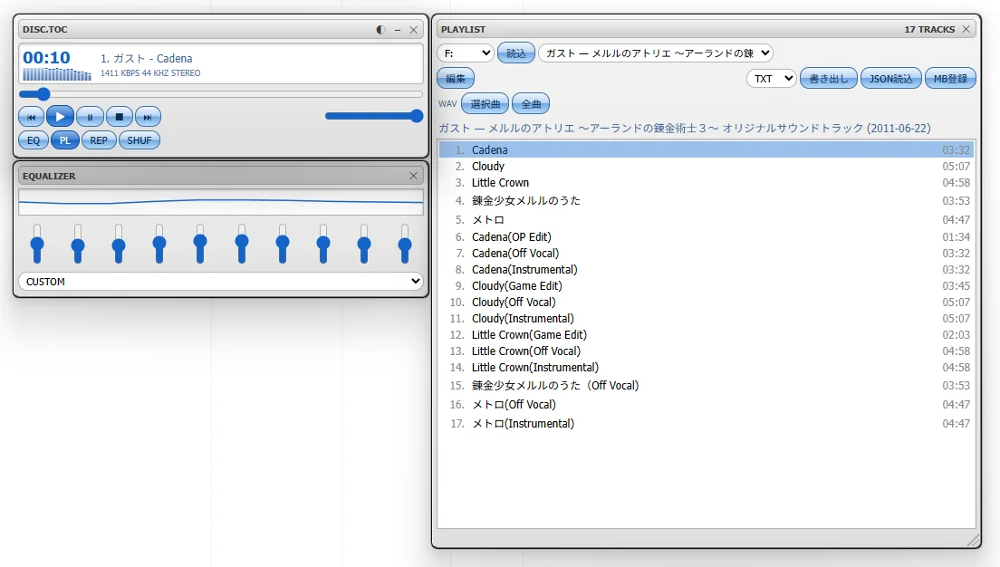

# DISC.TOC

**日本語** | [English](#english)

音楽CDを入れるだけで、アルバム名・アーティスト・曲名を表示して再生する軽量なデスクトップアプリ（Windows / Linux）。**管理者権限は不要**です。

Winamp や Windows Media Player で、CDを入れても曲名が出なくなった人向け。iTunes のような重いソフトを入れなくても、曲リストを見て再生できます。



## 特徴

- CDを入れると、自動で曲名・アーティスト・年を取得して表示（[MusicBrainz](https://musicbrainz.org/) を使用）
- **管理者権限なし**でドライブから直接読み取り（ディスクIDの計算・生音声の読み出しとも）
- トラックを選ぶとすぐ再生（読みながら再生するストリーミング方式）。シーク・音量・イコライザー・リピート・シャッフル付き
- クラシックなプレイヤー風の見た目。スキン切替（LAIN / AQUA）
- メイン・イコライザー・プレイリストは**別ウィンドウ**（枠なし）。自由に動かせて、近づけると吸着し、位置は次回起動で復元
- 曲名・アーティストの**手動編集**（MusicBrainz に無いCD向け）。編集内容はディスクごとに自動保存され、次回からネットなしで表示
- **書き出し**: TXT / CSV / CUE / JSON。JSON は読み込んで復元できる
- MusicBrainz への登録ページを開くボタン（情報が無いCDを、みんなで育てるDBに登録できる）
- コンピレーション盤（トラックごとにアーティストが違うCD）にも対応
- **WAV書き出し**: 選択曲または全曲をWAVで保存（読めないセクタは無音で埋めて報告）

## 動作環境

- Windows 10 / 11（WebView2 が必要。Windows 11 には標準で入っています）
- 光学ドライブ（CD-ROM / DVD / BD ドライブ）

**Linux**（v0.4.0 から）
- Debian 12 で動作確認。`.deb` / `.rpm` / `.AppImage` を配布
- ドライブ（`/dev/sr0` など）を読むには、ユーザーが `cdrom` グループに入っている必要があります。
  `sudo usermod -aG cdrom $USER` を実行して、ログインし直してください

macOS は今のところ対象外です。

## 使い方

1. CDをドライブに入れる
2. DISC.TOC を起動する（自動で読み込みます）
3. 曲をクリックすると再生
4. 曲名が出ない／間違っているときは「編集」で直して「保存」
5. 「書き出し」でファイルに保存、「MB登録」で MusicBrainz に登録

候補が複数あるCDでは、上部のプルダウンで別の版を選べます。

## 仕組み

1. Windows は `IOCTL_CDROM_READ_TOC`、Linux は `CDROMREADTOCENTRY` でCDの目次（TOC）を読む
2. TOC から MusicBrainz のディスクIDを計算し、MusicBrainz に問い合わせる。見つからないときは TOC 検索にフォールバック
3. 再生時は `IOCTL_CDROM_RAW_READ`（Linux は `CDROMREADAUDIO`）で1秒分ずつ生データを読み、読みながら Web Audio で再生

Windows ではドライブを通常の読み取り権限で開くため、管理者権限は要りません。

## ビルド

[Rust](https://www.rust-lang.org/) と Tauri の前提環境が必要です。

```
cargo install tauri-cli --version "^2"
cargo tauri dev        # 開発実行
cargo tauri build      # インストーラ作成
```

- `core/` … 純粋ロジック（TOC解析、ディスクID、書き出し形式）。`cargo test -p disctoc-core` でテスト
- `core/src/cd_win.rs` … Windows のドライブアクセス
- `core/src/cd_linux.rs` … Linux のドライブアクセス（`/dev/sr*` の ioctl）
- `src-tauri/` … Tauri アプリ本体
- `ui/` … 画面（素の HTML / CSS / JS。`skins/` にスキン）

## 現状と制限

- 動作確認は限られた環境（Windows と Debian 12 で、それぞれ1台のドライブ、数枚のCD）です。うまく動かないドライブやCDがあれば Issue で教えてください
- 再生開始は、ドライブのスピンアップ分（数秒）だけ遅れることがあります
- コピーガード付きのCD（CCCD など）は読めない場合があります
- Linux 版は、Debian 12 以外のディストリビューションや Wayland セッションでは未確認です
- MP3 / OGG 書き出しは未実装（WAV のみ）

## インストール

[Releases](../../releases) からダウンロードしてください。

- Windows: インストーラ（`.msi` または `.exe`）
- Linux: `.deb`（Debian / Ubuntu 系）、`.rpm`（Fedora 系）、`.AppImage`

## ライセンス

MIT License（[LICENSE](LICENSE)）

## データについて

曲情報は [MusicBrainz](https://musicbrainz.org/) から取得しています。MusicBrainz の核となるデータは CC0 で公開されています。取得は1秒1回以内の間隔で行います。

DISC.TOC は MusicBrainz、および他のいかなる音楽プレイヤーとも関係のない個人開発のアプリです。

---

<a id="english"></a>

# DISC.TOC (English)

A lightweight desktop app for Windows and Linux that shows album, artist and track names when you insert an audio CD, and plays it. **No administrator rights needed.**

Made for people whose Winamp or Windows Media Player no longer shows track names for audio CDs. You don't need a heavy suite like iTunes to see a track list and play a disc.


## Features

- Insert a CD and the album, artist, year and track names are fetched automatically from [MusicBrainz](https://musicbrainz.org/)
- Reads the drive directly **without admin rights** (both the TOC / disc ID and raw audio)
- Click a track to play it instantly (streamed straight from the drive), with seek, volume, equalizer, repeat and shuffle
- Classic player-style UI with switchable skins (LAIN / AQUA)
- Main, equalizer and playlist are **separate frameless windows**: drag them freely, they snap to each other, and positions are restored on next launch
- **Manual editing** of titles and artists for discs MusicBrainz doesn't know. Edits are saved per disc and shown offline next time
- **Export** to TXT / CSV / CUE / JSON. JSON can be imported back
- A button that opens the MusicBrainz "attach disc ID" page, so unknown discs can be added to the shared database
- Handles compilation discs with a different artist per track
- **WAV export**: save the selected track or the whole disc as WAV (unreadable sectors are filled with silence and reported)

## Requirements

- Windows 10 / 11 (WebView2 is required; it ships with Windows 11)
- An optical drive

**Linux** (since v0.4.0)
- Tested on Debian 12. `.deb`, `.rpm` and `.AppImage` packages are provided
- To read the drive (`/dev/sr0` etc.) your user must be in the `cdrom` group:
  run `sudo usermod -aG cdrom $USER`, then log out and in again

macOS is not supported for now.

## Usage

1. Insert a CD
2. Launch DISC.TOC (it loads the disc automatically)
3. Click a track to play it
4. If names are missing or wrong, press **Edit**, fix them and press **Save**
5. Use **Export** to save a file, **MB登録 (MB register)** to add the disc to MusicBrainz

If several releases match, choose one from the dropdown at the top.

## How it works

1. Reads the table of contents with `IOCTL_CDROM_READ_TOC` (Windows) or `CDROMREADTOCENTRY` (Linux)
2. Computes the MusicBrainz disc ID from the TOC and queries MusicBrainz; if that fails, falls back to a TOC search
3. For playback, reads raw data with `IOCTL_CDROM_RAW_READ` (Linux: `CDROMREADAUDIO`), streams it in one-second chunks and plays it with Web Audio

On Windows the drive is opened with ordinary read access, so no elevation is required.

## Build

Requires [Rust](https://www.rust-lang.org/) and the Tauri prerequisites.

```
cargo install tauri-cli --version "^2"
cargo tauri dev        # run in development
cargo tauri build      # build an installer
```

- `core/` – pure logic (TOC parsing, disc IDs, export formats). Test with `cargo test -p disctoc-core`
- `core/src/cd_win.rs` – Windows drive access
- `core/src/cd_linux.rs` – Linux drive access (`/dev/sr*` ioctls)
- `src-tauri/` – the Tauri app
- `ui/` – the UI (plain HTML / CSS / JS, skins in `skins/`)

## Status and limitations

- Tested on a limited setup (Windows and Debian 12, one drive and a few discs each). If a drive or disc doesn't work, please open an issue
- Playback may start a few seconds late while the drive spins up
- Copy-protected discs (e.g. CCCD) may not be readable
- The Linux build is untested on other distributions and on Wayland sessions
- MP3 / OGG export is not implemented yet (WAV only)

## Install

Download from [Releases](../../releases).

- Windows: installer (`.msi` or `.exe`)
- Linux: `.deb` (Debian / Ubuntu), `.rpm` (Fedora), or `.AppImage`

## License

MIT License ([LICENSE](LICENSE))

## Data

Track information comes from [MusicBrainz](https://musicbrainz.org/), whose core data is released under CC0. Requests are limited to one per second.

DISC.TOC is an independent personal project and is not affiliated with MusicBrainz or any music player.
